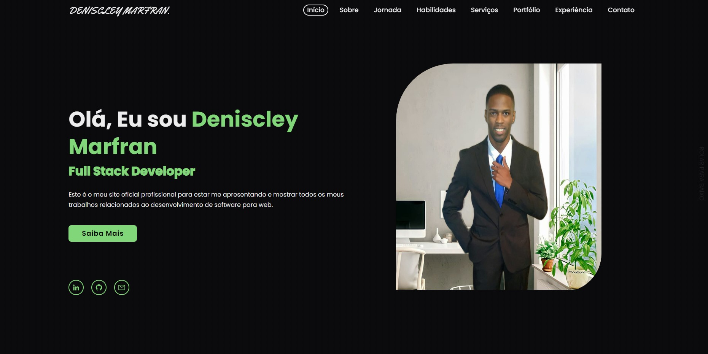

# Portfólio Profissional - Deniscley Marfran

Projeto de meu portfólio pessoal para apresentar meus trabalhos relacionados ao desenvolvimento web.


## Autores

- [@DeniscleyMarfran](https://github.com/Deniscley)

## Usado por

Esse projeto é usado pelas empresas interessadas em conhecer mais sobre meu trabalho.

## Funcionalidades

- Preview em tempo real
- Modo tela cheia
- Multiplataforma

## Stack utilizada

**Front-end:** NextJs, TypeScript, HTML5, CSS3

## Rodando localmente

Clone o projeto

```bash
  git clone https://github.com/Deniscley/Professional.Portfolio.Web
```

Instale as dependências

```bash
  npm install
```

Inicie o servidor

```bash
  npm run dev
  # or
  yarn dev
  # or
  pnpm dev
```

## Suporte

Para suporte, mande um email para deniscleymaf@outlook.com

## Etiquetas

Adicione etiquetas de algum lugar, como: [shields.io](https://shields.io/)

[](https://choosealicense.com/licenses/mit/)
[](https://opensource.org/licenses/)
[](http://www.gnu.org/licenses/agpl-3.0)

## Licença

[MIT](https://choosealicense.com/licenses/mit/)

## 🔗 Links

[](https://denis-marfran-portfolio.netlify.app)
[](https://www.linkedin.com/in/deniscleymarfran/)
[](https://twitter.com/DeniscleyMAF)

## Feedback

Se você tiver algum feedback, por favor nos deixe saber por meio de deniscleymaf@outlook.com

## FAQ

#### Qual o objetivo do projeto ?

Portfólio personalizado para falar um pouco sobre minhas qualidades profissional.

## Screenshots


